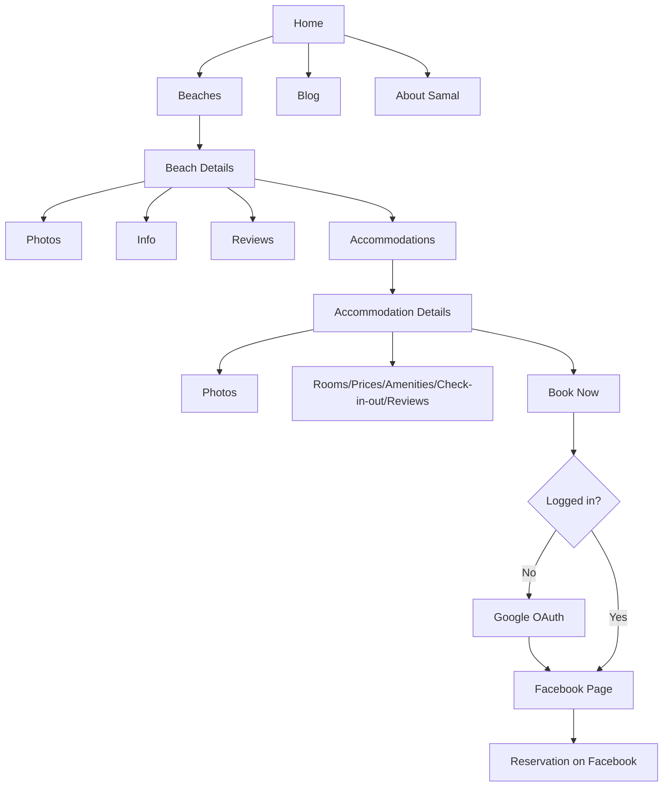

# 01 — Product Requirements (PRD)

**Status:** draft | **Last updated:** 2026-08-21 | **Source:** Spec §1-3, §7, §19-20, Final Scope

## 1.1 Goal

Provide one centralized, minimalist website where visitors discover Samal Island beaches, accommodations, rooms, amenities, maps, and blogs — with Google-authenticated favorites, ratings/reviews, and Facebook-redirect booking. No in-site reservations/payments.

> Final Scope: _Samaalon is a minimalist Samal Island travel and accommodation discovery platform that allows visitors to explore beaches, accommodations, room types, amenities, travel guides, maps, ratings, and reviews. Visitors can browse freely without an account, while Google-authenticated users can save favorites, submit ratings/reviews, manage their profiles, and access accommodation booking links. Samaalon does not process reservations or payments; instead, authenticated users are redirected to the accommodation's Facebook page to complete their reservation._

Objectives:

- Centralize beach/accommodation discovery (§1).
- Search/filter (§12), maps (§13), reviews (§8), favorites (§9).
- Blog travel guides (§11).
- External booking only (§6).

## 1.2 User Roles

### Visitor (unauthenticated)

Can: browse beaches/accommodations, read blogs, search/filter, view maps, read reviews.
Cannot: favorites, profile, Book Now, rate/review.

### Authenticated User (Google OAuth)

All Visitor perms + favorites (beaches/accommodations), profile (image/name/email, favorites, reviews), rate/review beaches & accommodations, Book Now.

### Admin (single, `ADMIN` role)

Manages: beaches, beach photos, amenities, accommodations, room types, accommodation photos, blog posts/categories, reviews/moderation, site content. Dashboard separate from public site. Server-verified role (§20).

## 1.3 Permission Matrix (§7)

| Feature                                           | Visitor | Google User | Admin |
| ------------------------------------------------- | ------- | ----------- | ----- |
| Browse beaches/accommodations/blogs               | ✅      | ✅          | ✅    |
| Search / Filters / Read reviews / View maps       | ✅      | ✅          | ✅    |
| Favorites (beach/accommodation)                   | ❌      | ✅          | ✅    |
| User profile                                      | ❌      | ✅          | ✅    |
| Book Now (Facebook redirect)                      | ❌      | ✅          | ✅    |
| Beach/Accommodation rating & review               | ❌      | ✅          | ✅*   |
| Manage beaches/accommodations/rooms/blogs/reviews | ❌      | ❌          | ✅    |

`*` Admin can moderate/delete any review.

## 1.4 Core User Flow



Public nav (minimalist, §14): `SAMAALON | Home | Beaches | Blog | About Samal | Login`. Home stack: Hero → Featured Beaches → Popular Accommodations → Things To Do → Latest Blog → About Samal.

## 1.5 Booking Flow (§6)

```
User → Accommodation → Book Now → Auth check → Google Login (if needed) → facebookUrl → external reservation
```

Each `Accommodation.facebookUrl` is stored by admin; button is a plain external link after auth.

## 1.6 Non-Goals (§19)

Will NOT implement in v1: online payment, in-site reservation/availability calendar, booking/cancellation management, payment gateway, staff accounts, OTP auth, separate Express backend, real-time chat, owner dashboard.

## 1.7 Security Baseline Summary (§20, detail in 05-auth.md)

Google OAuth only, protected admin routes, RBAC server-side, Zod + server validation, Prisma parameterized queries, sanitization, env secrets, HTTPS, rate limiting on reviews/favorites, moderation.

## 1.8 Acceptance Criteria (PRD-level)

- Unauthenticated browsing + search works; auth-gated features redirect to Google.
- Book Now always lands on correct `facebookUrl` after auth; no reservation state stored.
- Admin actions fail with 403 for non-ADMIN even if UI hidden.
- Reviews require auth, 1-5 stars + comment, target Beach OR Accommodation.
