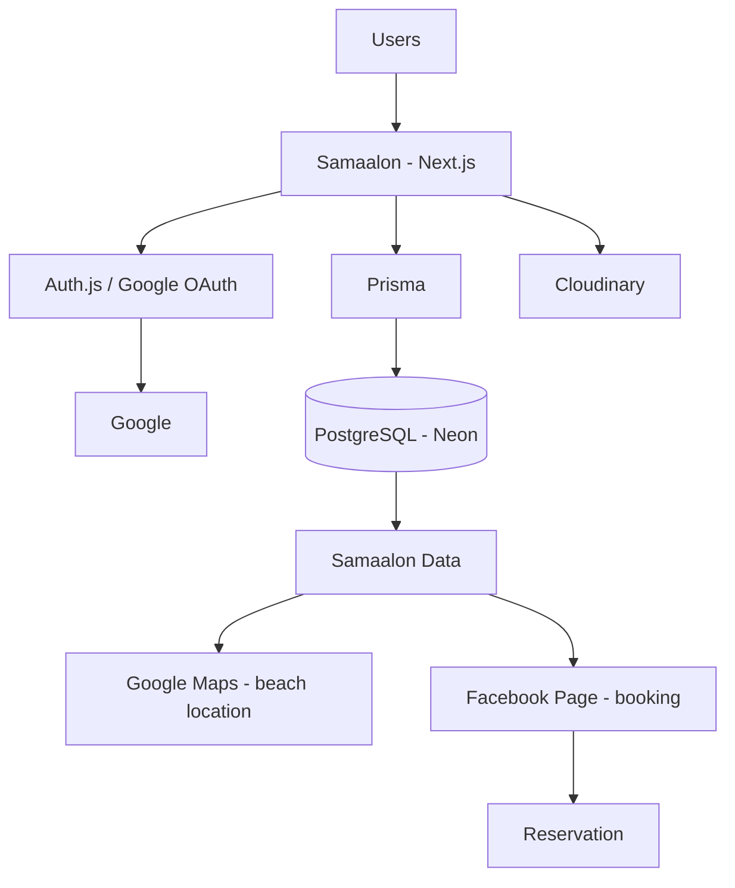

# 02 — Architecture

**Status:** draft | **Last updated:** 2026-08-21 | **Source:** Spec §17, §18, §21, §20-22

## 2.1 Stack (§17)

| Layer | Choice | Notes |
|-------|--------|-------|
| Frontend/Backend | Next.js App Router + TypeScript | Route Handlers, Server Actions, Server/Client Components — no separate Express |
| Styling | Tailwind CSS + shadcn/ui | Minimalist design, responsive |
| Database | PostgreSQL (Neon) | |
| ORM | Prisma | Parameterized queries |
| Auth | Auth.js + Google OAuth | No passwords |
| Validation | Zod | Server + client |
| Forms | React Hook Form | |
| Images | Cloudinary | Beach/accommodation/blog photos |
| Maps | Google Maps Platform | lat/lng + maps URL |
| Dev | Docker, Git + GitHub | |
| Deploy | Vercel (app) + Neon (DB) + Cloudinary | Facebook for booking |

## 2.2 High-Level Architecture (§18)



Booking: `Accommodation.facebookUrl` stored in DB; `Book Now` → auth check → external redirect (no reservation tables).

## 2.3 Project Structure (§21, text-only)

```
samaalon/
├── app/
│   ├── (public)/         # page.tsx, beaches/, accommodations/, blog/, about/
│   ├── admin/            # dashboard/, beaches/, accommodations/, room-types/, blog/, reviews/
│   └── api/              # reviews/, favorites/, ...
├── components/
│   ├── ui/               # shadcn/ui
│   ├── beaches/ accommodations/ reviews/ blog/ admin/
├── lib/
│   ├── auth.ts           # Auth.js config
│   ├── prisma.ts
│   ├── validations/      # Zod schemas
│   └── utils/
├── prisma/
│   └── schema.prisma     # created Phase 2 (ERD in 03-database.md)
├── public/
├── docker/               # Dockerfile, docker-compose.yml (Phase 1)
├── .env                  # not committed
└── docs/                 # this folder
```

## 2.4 Environment Variables (planned)

```
DATABASE_URL=           # Neon Postgres
AUTH_SECRET=            # Auth.js
AUTH_GOOGLE_ID= / AUTH_GOOGLE_SECRET=
CLOUDINARY_CLOUD_NAME= / CLOUDINARY_API_KEY= / CLOUDINARY_API_SECRET=
NEXT_PUBLIC_GOOGLE_MAPS_API_KEY=  # if interactive map
ADMIN_EMAIL=            # single admin identifier
```

All secrets server-only; never exposed via `NEXT_PUBLIC_` except Maps key with restrictions. HTTPS in prod (§20).

## 2.5 Patterns

- Server Components by default; Client where interaction (filters, favorites, reviews).
- Validation: Zod on Route Handlers + Server Actions before Prisma.
- Images: upload via Cloudinary, store URL in DB.
- Maps: store `latitude`, `longitude`, `googleMapsUrl` (§13); link + optional embed.
