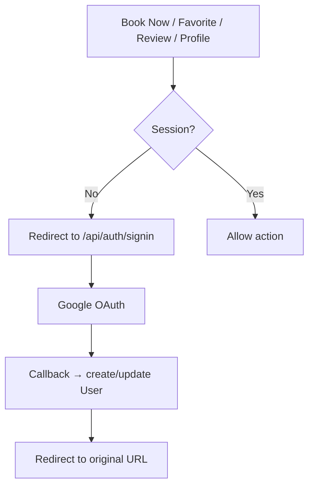

# 05 — Authentication & Security

**Status:** draft | **Last updated:** 2026-08-21 | **Source:** Spec §7, §20, §15

## 5.1 Authentication — Google OAuth Only

Primary: **[Continue with Google]** via Auth.js. No Samaalon passwords, no OTP. Flow:

- Provider: Google; `User` created on first sign-in (email, name, image). Role defaults `USER`.
- Sessions: Auth.js JWT or database (choose one in Phase 4; recommend JWT for Vercel).
- Single Admin identified by `ADMIN` role or `ADMIN_EMAIL` env; no self-registration to admin.

## 5.2 Authorization (RBAC)

| Capability | Visitor | USER | ADMIN |
|------------|---------|------|-------|
| Browse/search/read | ✅ | ✅ | ✅ |
| Favorites, profile, reviews, Book Now | ❌ | ✅ | ✅ |
| Admin CRUD (beaches/accommodations/rooms/blogs/reviews) | ❌ | ❌ | ✅ |

**Server enforcement (§20):** never rely on hidden buttons. Every Route Handler/Server Action checks `auth()` + `user.role === 'ADMIN'` and returns 403 otherwise. Middleware protects `/admin/*` and `/api/admin/*`.

## 5.3 Protected Surfaces

- Pages: `/profile`, `/favorites`, `/admin/*` — redirect to sign-in if unauthenticated; 403 if non-admin on admin.
- APIs: `/api/reviews` (POST/PUT/DELETE), `/api/favorites`, `/api/admin/*` — validate session + Zod, rate limit.
- Book Now: client checks session; server also checks before exposing `facebookUrl` if sensitive (or show URL only after auth).

## 5.4 Security Requirements (§20)

- Google OAuth only; no password storage.
- Zod validation on all inputs (client + server).
- Prisma parameterized queries; no raw SQL interpolation.
- Input sanitization (strip HTML in comments).
- Secure env vars; no secrets in client bundle; `AUTH_SECRET` required.
- Review moderation: admin can delete; optional profanity filter.
- Rate limiting: reviews/favorites/search (e.g., 10/min per IP/user).
- HTTPS in production (Vercel default).
- No exposed Cloudinary/Google Maps secrets.

## 5.5 Validation (planned)

- Zod schemas in `lib/validations/` for Beach, Accommodation, RoomType, Review, BlogPost.
- Server Actions + Route Handlers validate before DB.

## 5.6 Phase 4 Exit Criteria

- Google sign-in works locally + on Vercel; session persists.
- Non-admin cannot access admin APIs (verified with 403 test).
- Auth-gated features redirect correctly; profile shows Google data.
